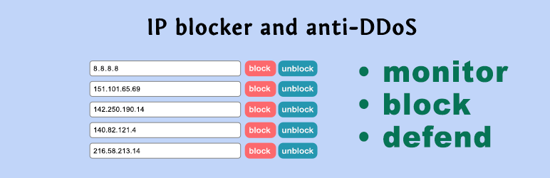
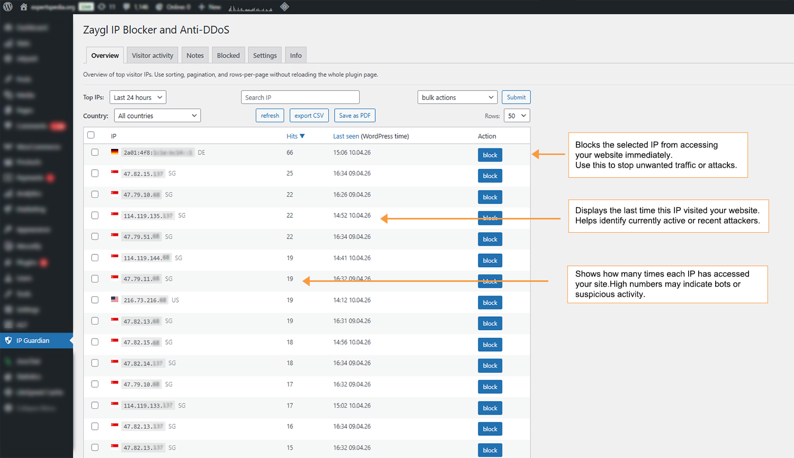
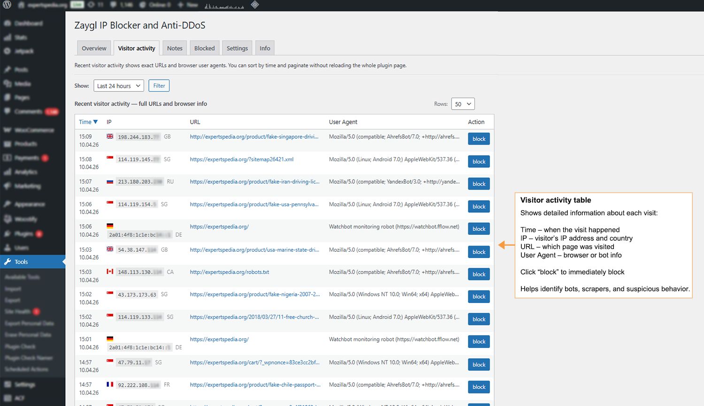
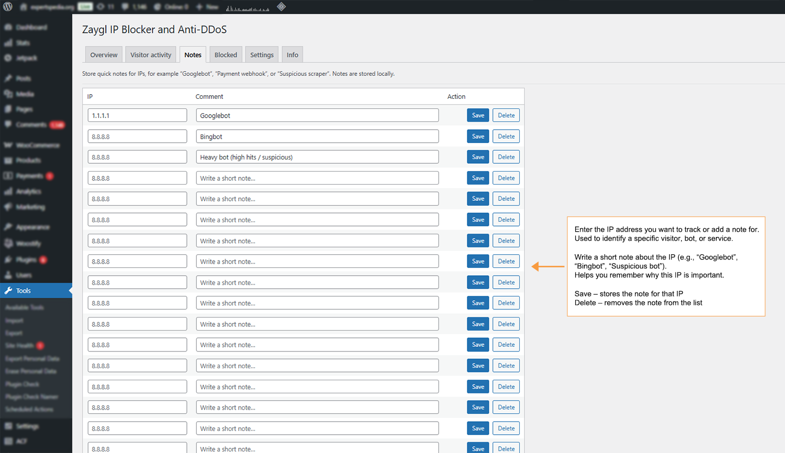
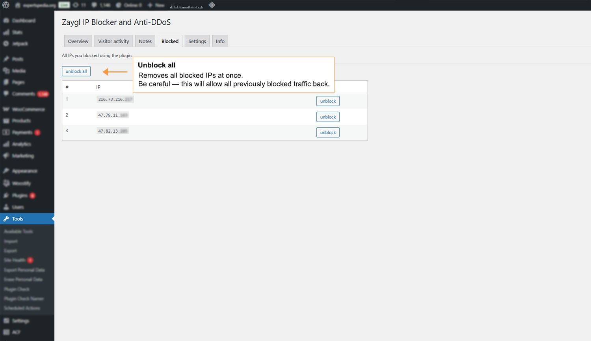
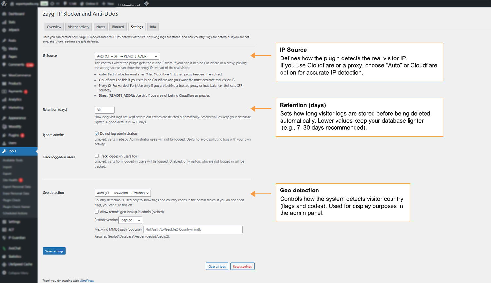
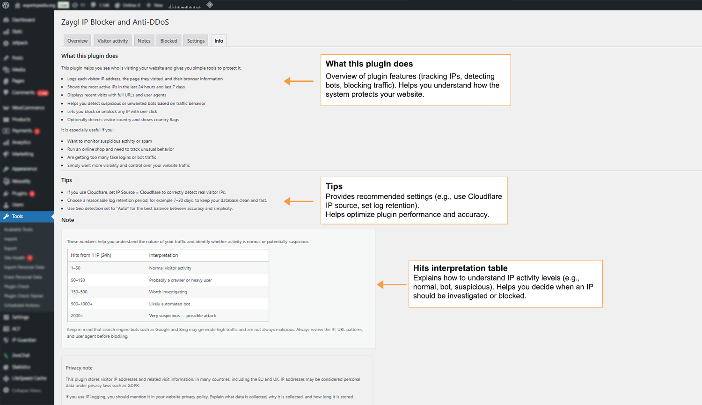

# 🛡️ Zaygl – IP Blocker & Anti-DDoS for WordPress

Monitor visitor activity, detect suspicious traffic, and block unwanted IP addresses with one click.

---

## 🔥 Overview

**Zaygl IP Blocker and Anti-DDoS** is a lightweight WordPress security plugin designed to help you monitor traffic and protect your website from suspicious activity.

Track visitor IPs, analyze traffic patterns, and instantly block problematic users — all from your WordPress dashboard.

---

## ✨ Features

- 📊 **IP Logging System**  
  Track visitor IP addresses, requests, and activity

- 🧠 **Traffic Insights**  
  View top IPs and detect unusual behavior

- ⏱️ **Time-Based Statistics**
  - Last 5 minutes  
  - Last 1 hour  
  - Last 24 hours  
  - Last 3 days  
  - Last 7 days  

- 🚫 **One-Click IP Blocking**  
  Instantly block or unblock any IP address

- 📦 **Bulk Actions**  
  Block or unblock multiple IPs at once

- 🧾 **Recent Requests Viewer**  
  Inspect real-time visitor activity

- 🌍 **Country Detection (Optional)**  
  Identify traffic origin using multiple methods

- 📝 **IP Notes System**  
  Add notes to track suspicious users

- 📤 **CSV Export**  
  Export IP lists for analysis

- ⚡ **Lightweight & Fast**  
  Optimized for performance

---

## 🧩 Dashboard Overview

Zaygl adds a dedicated admin panel where you can:

- View traffic statistics
- Identify top active IPs
- Search and filter IP addresses
- Block/unblock IPs
- Add notes to suspicious visitors
- Export reports

---

## 🎯 Who Is This For?

- Website owners monitoring traffic
- WordPress admins dealing with bots/spam
- Sites experiencing traffic spikes
- Developers needing simple IP tracking

---

## 🚫 Blocking Behavior

When an IP is blocked:

- Receives **403 Forbidden**
- Request is stopped early (before full WP load)
- Access remains blocked until manually removed

---

## 🌍 Country Detection

Optional country detection methods:

- Cloudflare header
- Local MaxMind GeoLite2 database
- Remote API lookup

Can be fully disabled if not needed.

---

## 🖼️ Screenshots

### 1. Traffic Overview

### 2. Recent Requests Table

### 3. IP Blocking Interface

### 4. IP Notes System

### 5. Settings Panel

### 6. Info Panel

---

## 🔌 Installation

1. Upload plugin to `/wp-content/plugins/`
2. Activate the plugin
3. Open **Zaygl IP Blocker** in admin menu

No extra setup required.

---

## 🌐 External Services

Used only if enabled by admin for geolocation:

- ipapi.co → https://ipapi.co/
- ip-api.com → https://ip-api.com/

👉 Only visitor IP is sent for country detection  
👉 No data is sent unless feature is enabled

---

## 💾 Data Storage

Stored locally in your WordPress database:

- IP address
- Request time
- URL
- User agent
- Country (optional)

---

## ❓ FAQ

### Does it slow down the site?
No — designed to be lightweight.

### Can I disable logging?
Yes, via settings.

### Can I block multiple IPs?
Yes, bulk actions supported.

### Is this a firewall?
No — it’s a monitoring & blocking tool.

---

## 📦 Changelog

### 1.0.0
- Initial release
- IP logging system
- Traffic stats
- Blocking system
- Notes feature
- CSV export
- Optional geolocation

---

## 🔗 WordPress Plugin Page

👉 https://wordpress.org/plugins/zaygl-ip-blocker-and-anti-ddos/

---

## ❤️ Support

Found a bug or have an idea? Open an issue or contact us.

---

## 📜 License

GPLv2 or later  
https://www.gnu.org/licenses/gpl-2.0.html
